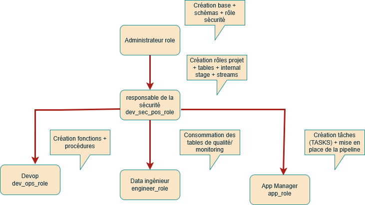
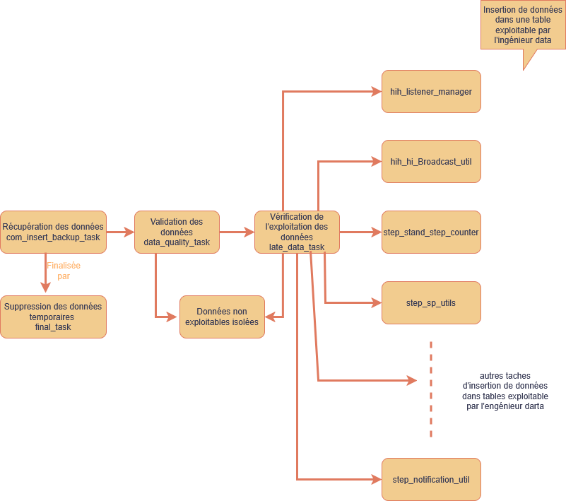

#SNOWFLAKE Project: Creating a Data Integration Pipeline
##Project Description

In this project, I created a data integration pipeline for a log file from a fictional healthcare application (however, the process names are taken from this GitHub repository: [GitHub](https://github.com/QuantikDataStudio/cours_snowflake/blob/main/dataset/HealthApp_2k.log)). The application sends messages that are stored in the data_source.csv file. The pipeline checks data quality, transforms the data, and then dispatches it to the final tables.

##Technical Stack

* **Snowflake**: Primary platform for data pipeline orchestration, modeling via advanced SQL, process automation with tasks (TASKS), and scalable management of continuous ELT flows.
* **Snowflake Tasks (TASKS)**: Primary tool for orchestrating and automating ELT pipelines, cron scheduling of SQL processes, creating DAGs of dependencies between tasks, and continuously executing data transformations in a virtual environment.
* **Snowflake Internal Stage**: Primary temporary storage area within Snowflake for uploading CSV files via PUT, intermediate staging of raw data prior to COPY INTO, configuration of custom file formats (TIMESTAMP_FORMAT, delimiters), and seamless integration of ELT pipelines with automated tasks.
* **CSV:**  The primary format for exchanging and temporarily storing raw data, preparing source files for ELT pipelines, quickly exporting from LibreOffice/Excel, and performing scalable initial loads into Snowflake via COPY INTO.
* **Snowflake RBAC:**  Primary role-based access control system, granular privilege management on databases/schemas/tables, hierarchical assignment of roles to users, and securing data pipelines according to the principle of least privilege.
## Areas of Focus
### Administrator’s Perspective
* Creating the database and database schemas. The RAW schema retrieves data from the application. The COMMON schema manages the pipeline. The STAGING schema contains tables with data from the pipeline.
* Creating the security administrator role.
* Files:
  * [init_database](init_database.sql)
  * [role_by_admin](role_by_admin.sql)
### Security Manager's Perspective
* Creation of the DevOps, Engineer, and Application Management roles.
* File: [role_by_dev_sec_ops_role](role_by_dev_sec_ops_role.sql)
* They set up the database structure by creating the tables required by the pipeline and the internal directory to store the file provided by the application.
* Files:
  * [create_tables](create_tables.sql)
  * [create_stream](create_stream.sql)
### DevOps perspective
* This person creates the tools to build the pipeline.
* The pipeline retrieves the data and stores it in a temporary table. It verifies that the data is valid (existing process names and dates that are not in the future) and isolates invalid data. It then verifies that the data is recent enough (no older than 5 days) and isolates data that is too old. Finally, it formats the data correctly (process name separated from its log message) and places it in the final tables (one table per process).
* Files:
  * [create_functions](create_functions.sql)
  * [create_procedure](create_procedure.sql)
### Data Engineer's Perspective
* In the COMMON schema, they have access to a table of invalid data (**com_abnormal_event**), a table of data that is too old (**com_late_data**), a pipeline log table (**com_logging**), and a table that indicates whether the pipeline ran successfully (**com_pipeline**).
### Application Manager's Perspective
* The application manager sets up the pipeline using the tools prepared by DevOps and Snowflake tasks.
* File: [create_tasks](create_tasks.sql)

## RBAC Model

Diagram representing the implemented RBAC model.

## Pipeline

Diagram representing the directed acyclic graph (DAG) of the implemented pipeline.

## Value Added
An automated and industrialized ELT pipeline that transforms “raw” CSV logs into clean, ready-to-use analytical data for Power BI/Looker.
## Files to Download
### The data file
It consists of lines in the following format: **YYYYMMDD-HH:MM:SS.mmm|number|process name: process message**

For example: **20251216-15:29:06.606|1423|HiH_ListenerManager: Listener management process completed successfully** 

The process names must be included in the list:  HiH_ListenerManager, HiH_HiBroadcastUtil, Step_StandStepCounter, Step_SPUtils, Step_NotificationUtil, Step_LSC, HiH_HiHealthDataInsertStore, HiH_DataStatManage, HiH_HiSyncUtil, Step_StandReportReceiver, Step_ScreenUtil, Step_StandStepDataManager, Step_ExtSDM, HiH_HiHealthBinder, Step_DataCache, Step_HGNH, Step_FlushableStepDataCache, HiH_HiAppUtil, HiH_HiSyncControl.	

The following files must be executed in this order in Snowflake:
   * [role_by_adminl](role_by_admin.sql)  
   * [init_database](init_database.sql)
   * [role_by_dev_sec_ops_role](role_by_dev_sec_ops_role.sql)
   * [create_tables](create_tables.sql) (in the RAW schema)
   * [create_stream](create_stream.sql) (in the RAW schema)
   * [create_functions](create_functions.sql) (in the COMMON schema)
   * [create_procedure](create_procedure.sql) (in the COMMON schema)
   * [create_tasks](create_tasks.sql) (in the COMMON schema)
     
The [data_source_csv](data_source_csv.csv) data file should be placed in the internal_stage directory.

# Projet SNOWFLAKE : création d'une pipeline d'intégration de données
## Description du projet
Dans ce projet, j'ai créé une pipeline d'intégration de données d'un fichier de log d'une application de santé fictive (néanmoins les noms de processus viennent de ce [GitHub](https://github.com/QuantikDataStudio/cours_snowflake/blob/main/dataset/HealthApp_2k.log) ).
L'application envoie des messages stockés dans le fichier data_source.csv. La pipeline vérifie la qualité des données, transforme les données puis les dispatche dans les tables finales.
## Stack technique
* **Snowflake :**  Plateforme principale pour l'orchestration des pipelines de données, la modélisation via SQL avancé, l'automatisation des traitements avec les tâches (TASKS), et la gestion scalable des flux ELT en continu.
* **Tâches Snowflake (TASKS) :**  OOutil principal pour l’orchestration et l’automatisation des pipelines ELT, la planification cron des traitements SQL, la création de DAGs de dépendances entre tâches, et l’exécution continue des transformations de données dans un environnement virtuel.
* **Internal Stage Snowflake :**  Zone de stockage temporaire principale au sein de Snowflake pour l'upload de fichiers CSV via PUT, le staging intermédiaire des données brutes avant COPY INTO, la configuration de file formats personnalisés (TIMESTAMP_FORMAT, délimiteurs), et l'intégration fluide des pipelines ELT avec les tâches automatisées.
* **CSV :**  Format principal pour l'échange et le stockage intermédiaire de données brutes, la préparation des fichiers sources pour les pipelines ELT, l'export rapide depuis LibreOffice/Excel, et le chargement initial scalable vers Snowflake via COPY INTO.
* **RBAC Snowflake :**  Système principal de contrôle d'accès basé sur les rôles, la gestion granulaire des privilèges sur bases/schémas/tables, l'attribution hiérarchique de rôles aux utilisateurs, et la sécurisation des pipelines de données selon le principe du moindre privilège.
## Axes étudiés
### Vision de l'administrateur
* Création de la base de données et création des schémas de la base de données. Le schéma RAW récupère les données de l'application. Le schéma COMMON gère la pipeline. Le schéma STAGING contient les tables avec les données issues de la pipeline.
* Création du rôle du responsable de la sécurité.
* Fichiers :
  * [init_database](init_database.sql)
  * [role_by_admin](role_by_admin.sql)
### Vision du responsable de la sécurité
* Création des rôles de devops, d'ingénieur et de gestion de l'application.
* Fichier : [role_by_dev_sec_ops_role](role_by_dev_sec_ops_role.sql)
* Il met en place la structure de la base de données en créant les tables dont la pipeline a besoin, le répertoire interne pour stocker le fichier fourni par l'application.
* Fichiers :
  * [create_tables](create_tables.sql)
  * [create_stream](create_stream.sql)
### Vision devops
* C'est lui qui crée les outils pour créer la pipeline.
* La pipeline récupère les données et les stocke dans une table temporaire. Elle vérifie que les données soient valides (nom de processus existants, et date qui ne soit pas dans le futur) et isole les données non valides. Ensuite elle vérifie que les données soient suffisamment récentes (pas plus vieilles que 5 jours) et isole les données trop vieilles. Enfin elle met les données au bon format (nom du processus séparé de son message de log) dans les tables finales (une table par processus).
* Fichiers :
  * [create_functions](create_functions.sql)
  * [create_procedure](create_procedure.sql)
### Vision data ingénieur
* Il a à disposition dans le schéma COMMON une table de données non valides (**com_abnormal_event**), une table de données trop vieilles (**com_late_data**), une table de log de la pipeline (**com_logging**) et une table qui lui indique si la pipeline s'est bien déroulée (**com_pipeline**).
### Vision gestionnaire de l'application
* C'est lui qui met en place la pipeline à l'aide des outils préparés par le devops et les tasks de Snowflake.
* Fichier : [create_tasks](create_tasks.sql)

## Modèle RBAC

Schéma représentant le modèle RBAC mis en place.

## Pipeline

Schéma représentant le graphe acyclique dirigé (DAG) de la pipeline mise en place.

## Valeur ajoutée
Pipeline ELT automatisé et industrialisé qui transforme des logs CSV "bruts" en données analytiques propres et prêtes pour Power BI/Looker.
## Fichiers à télécharger
### Le fichier de donnée
Il est formé de ligne de la forme : **AAAAMMJJ-HH:MM:SS.mmm|nombre|nom du processus : message du processus**

Par exemple : **20251216-15:29:06.606|1423|HiH_ListenerManager: Processus de gestion des listeners terminé avec succès** 

Le nom des processus doit être compris dans la liste :  HiH_ListenerManager, HiH_HiBroadcastUtil, Step_StandStepCounter, Step_SPUtils, Step_NotificationUtil, Step_LSC, HiH_HiHealthDataInsertStore, HiH_DataStatManage',HiH_HiSyncUtil, Step_StandReportReceiver, Step_ScreenUtil, Step_StandStepDataManager, Step_ExtSDM, HiH_HiHealthBinder, Step_DataCache, Step_HGNH, Step_FlushableStepDataCache, HiH_HiAppUtil, HiH_HiSyncControl.	

Il faut exécuter dans cet ordre les fichiers suivants dans Snowflake :
   * [role_by_adminl](role_by_admin.sql)  
   * [init_database](init_database.sql)
   * [role_by_dev_sec_ops_role](role_by_dev_sec_ops_role.sql)
   * [create_tables](create_tables.sql) (dans le schéma RAW)
   * [create_stream](create_stream.sql) (dans le schéma RAW)
   * [create_functions](create_functions.sql) (dans le schéma COMMON)
   * [create_procedure](create_procedure.sql) (dans le schéma COMMON)
   * [create_tasks](create_tasks.sql) (dans le schéma COMMON)
     
Le fichier de données [data_source_csv](data_source_csv.csv) est à mettre dans internal_stage.
 
   

